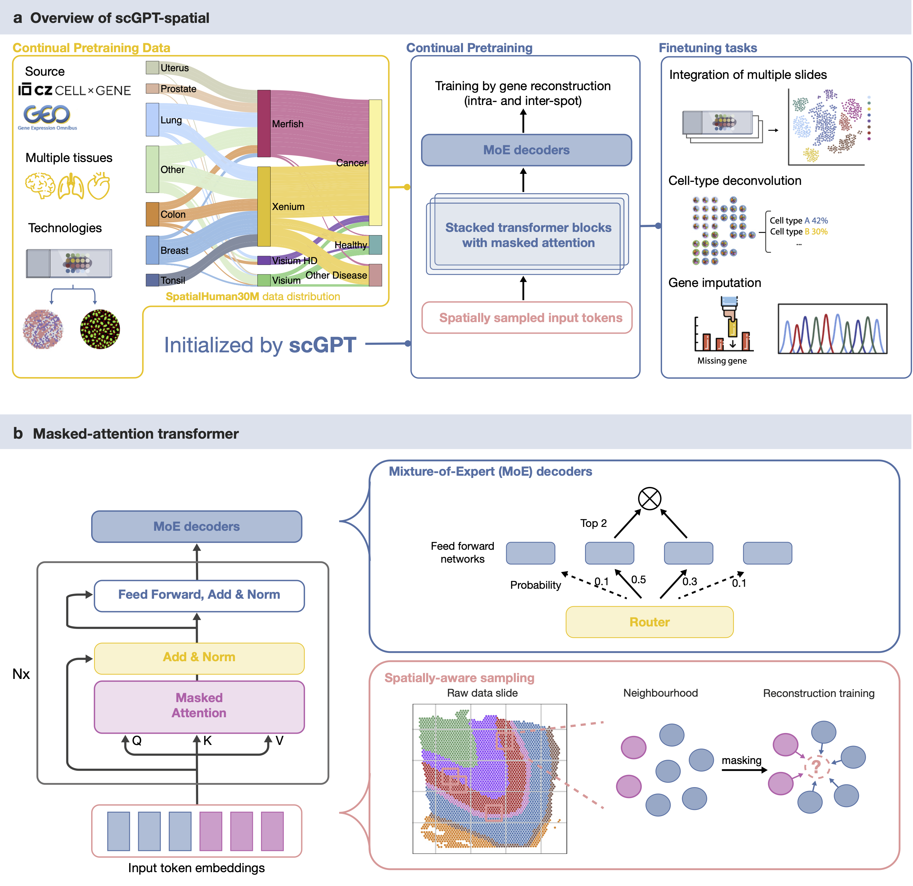

# scGPT-spatial: Continual Pretraining of Single-Cell Foundation Model for Spatial Transcriptomics 

[](https://www.biorxiv.org/content/10.1101/2025.02.05.636714v1) &nbsp;

## 🟩 </ins>TL,DR Highlights 🟩

✨ Spatial-omic foundation model ✨ ✨ Continual pretraining of [scGPT](https://github.com/bowang-lab/scGPT) on 30 million cells/spots ✨ 


✨ Novel MoE (Mixture of Experts) decoders ✨ ✨ Spatially-aware sampling ✨ ✨ Neighborhood-based reconstruction objective ✨ 


✨ Curation of *SpatialHuman30M* corpus ✨ ✨ Visium, Visium HD, Xenium, MERFISH ✨


✨ Multi-modal and multi-slide integration ✨ ✨ Cell-type deconvolution ✨ ✨ Missing gene imputation ✨


## 🟧 Model Weights 🟧

scGPT-spatial V1 weights on [figshare](https://figshare.com/articles/software/scGPT-spatial_V1_Model_Weights/28356068?file=52163879).

## 🟫 SpatialHuman30M 🟫
Pretraining dataset names, slide metadata, and access links are summarized in [data source table](https://figshare.com/articles/dataset/Pretraining_Data_Sources_for_SpatialHuman30M/28405961?file=52318895). Processed data will be available upon publication given permission under license of the original data source.

## 🟦 Setup and Tutorials 🟦
To start, clone the current repo:

`git clone https://github.com/bowang-lab/scGPT-spatial`

Special acknowledgement to the scGPT codebase - for environment setup please follow [instructions](https://github.com/bowang-lab/scGPT) there.

Check out our zero-shot inference [tutorial](https://github.com/bowang-lab/scGPT-spatial/tree/main/tutorials) on github! More code coming soon.

## 🟪 Preprint and Citation 🟪

Check out our preprint! https://www.biorxiv.org/content/10.1101/2025.02.05.636714v1

```bibtex
@article{wang2025scgpt,
  title={scGPT-spatial: Continual Pretraining of Single-Cell Foundation Model for Spatial Transcriptomics},
  author={Wang, Chloe Xueqi and Cui, Haotian and Zhang, Andrew Hanzhuo and Xie, Ronald and Goodarzi, Hani and Wang, Bo},
  journal={bioRxiv},
  pages={2025--02},
  year={2025},
  publisher={Cold Spring Harbor Laboratory}
}
```


